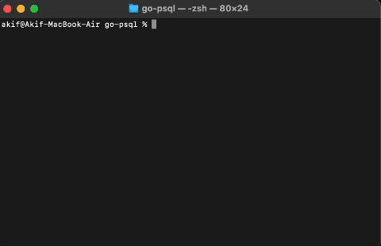

# PostgreSQL TUI with Bubble Tea

This is a terminal user interface (TUI) application built with Bubble Tea that connects to a PostgreSQL database and displays data in a table format.

## Features

- Connect to a PostgreSQL database
- Display data from a selected table
- Navigate through the table using keyboard keys
- Delete records from the table



## Prerequisites

- Go
- PostgreSQL database


## To do

- Add create, update  record
- Add create,delete database
- Refactor error handling 


## Installation

1. **Clone the repository**

    ```sh
    git clone https://github.com/akifzdemir/postgres-tui.git
    cd postgres-tui
    ```

2. **Install dependencies**

   Ensure you have the necessary Go modules:

    ```sh
    go mod tidy
    ```

3. **Run the application**

    ```sh
    go run main.go
    ```


## Code Structure

- **main.go**: The entry point of the application. Connects to the database and initializes the TUI.
- **models/**: Contains the Bubble Tea models for managing the TUI states and interactions.
   
- **constants.go**: Defines constant values used across the application.
